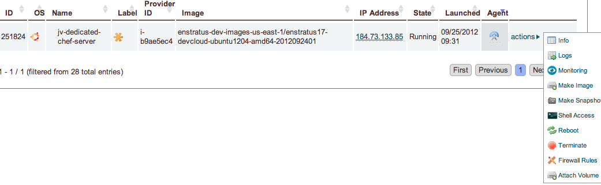

Agent
=====

.. enStratus documentation master file, created by
   sphinx-quickstart on Mon Mar 12 21:46:44 2012.
   You can adapt this file completely to your liking, but it should at least
   contain the root `toctree` directive.

   enStratus Agent

.. figure:: ./images/agent_splash_log.png
   :width: 700 px
   :height: 500 px
   :scale: 75 %
   :align: center

   enStratus Agent Logging

.. toctree::
   :maxdepth: 2
   :hidden:
   :glob:
    
   downloads/downloads
   installation/installation
   linux/linux
   proxy/proxy
