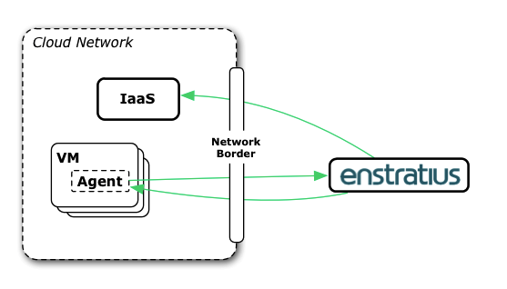
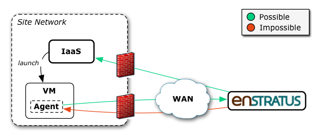
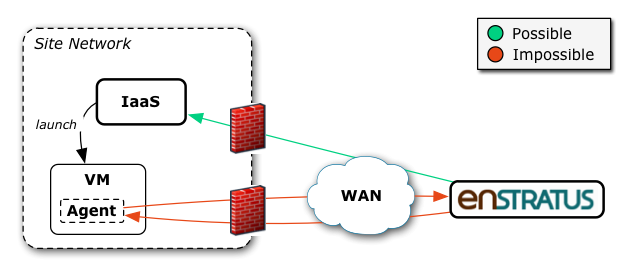
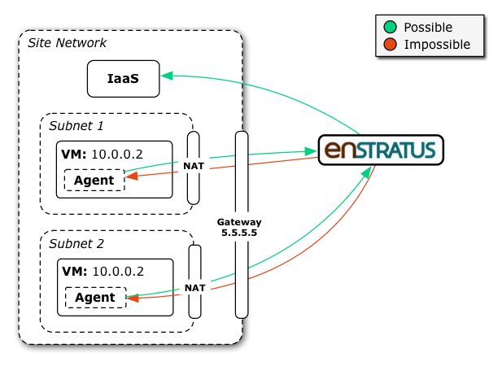
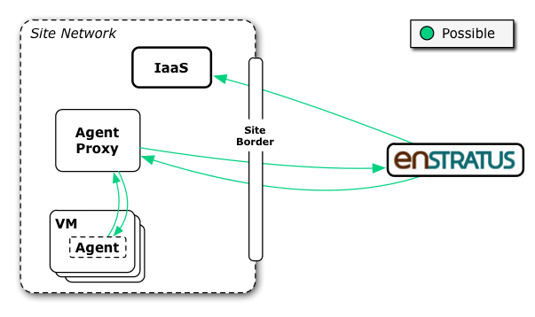

.. _agent_proxy_background:

Background
----------

Without the ability to interact with an Enstratius agent on your cloud resources,
many automation and security features are not supported. The Enstratius agent
proxy is a service installed on a node (or set of nodes) running on a cloud or
on-premises network that allows Enstratius to contact resources that would
otherwise be inaccessible.

There are two classes of problems that agent proxies solve:

* The cloud API endpoint is accessible from Enstratius but VMs are not.
* One cloud API, multiple VMs assigned the same local IP address.

There are problems agent proxies cannot solve:

* The cloud API endpoint is inaccessible from Enstratius.
* Enstratius is inaccessible from the VM instances even through a dedicated proxy.

Agent Interactions
~~~~~~~~~~~~~~~~~~

Before discussing the network problems in detail, a quick review of how
cloud resources with backups and automation normally work:

1. Enstratius starts and monitors a new VM via a cloud API.
2. The agent on the new VM instance starts (normally via the init.d mechanism or equivalent).
3. The agent initiates the handshake process with the configured URL.
4. The handshake is negotatied between agent and Enstratius.
   
   * A part of this handshake is especially important to the problems below: some of the information used to recognize a new VM instance trying to handshake are the IP address and cloud-given instance ID that the agent can assert about its host VM.

5. After the handshake is complete, the agent now listens for instructions
   asynchronously and also periodically reaches out to Enstratius of its own
   accord. 

These communications to and from the agent are necessary for Enstratius to
provide advanced automation, backup, user provisioning, logging, and intrusion
detection capabilities.

Problem: Cloud accessible, VMs inaccessible
~~~~~~~~~~~~~~~~~~~~~~~~~~~~~~~~~~~~~~~~~~~

There are situations when Enstratius can connect to a cloud API but has no route
to contact the VM's Enstratius agent for automation. An example of this case is
when you want to use Enstratius with a private cloud but there is no route to
the VMs which are on a private, but NAT'd network. As depicted here:

In rarer situations, the agents cannot even initiate a handshake because they
have no outbound route. In SaaS --> private cloud situations, this
is the case when the VMs have no internet access (or if there a very strict
outbound access policy), as depicted:

Problem: One cloud API, duplicate IP addresses
~~~~~~~~~~~~~~~~~~~~~~~~~~~~~~~~~~~~~~~~~~~~~~

There are sitautions where a private cloud will launch multiple VMs with the
same private IP address. This can occur when there are multiple zones
configured, an example being where CloudStack virtual routers are employed in
front of many isolated networks to provide NAT.
 
The following diagram shows an example of two VMs with the same local IP:

Consider this situation. When each agent initializes, they have no problem
contacting the dispatcher to initiate the handshake (the green arrows back to
Enstratius). Two problems arise at that point though:
 
1. For private clouds where the agent cannot reflect and report on its VM
instance ID, only the reported private IP is sent in the handshake and used by
Enstratius for correlation. Since both communications are seen as coming from the
same gateway (5.5.5.5), there is nothing to distinguish the two VMs (except
perhaps where each VM is in their expected lifecycle but this is tenuous).
 
2. As in a previous example, Enstratius has no direct route back to the VMs here.
But even if there were some channel open, how would Enstratius be able to contact
one 10.0.0.2 and not the other 10.0.0.2 without some supporting, topology-aware
mechanism?
 
(Note that this is not unique to the public internet case, the same situations
can occur in multi-network situations for on-premises installs.)

To further complicate things, Enstratius may be working against multiple private
clouds that are employing the same private address space.

Agent Proxy
~~~~~~~~~~~

An Enstratius agent is configured to handshake with a certain service endpoint.
To employ the agent proxy, one change is necessary: point to a new service
endpoint.

The agent proxy acts like Enstratius to the agent: the service signature is
identical. The agent proxy is stateless, however, and simply forwards the
traffic "upstream" to Enstratius. For the opposite direction, Enstratius contacts
the agent proxy as if it was a regular agent interaction - but with some
metadata about where it should be routed.

So now each communication path is possible:

The agent proxy:

* is a service you run on a node nearer to the cloud resources in question.
* has the same service signature that agents normally talk to: agents can not
  tell the difference between an agent proxy and Enstratius proper.
* requires network access to the cloud resources in question.
* requires network access to Enstratius, but only one ``ip:port`` firewall
  rule is required in each direction.
* can be deployed behind a load balancer for high availability and extreme load.
* does not require any database: it is completely stateless.
* modifies agent handshake security semantics; this is discussed in detail in
  the next section.

Handshake Implications
~~~~~~~~~~~~~~~~~~~~~~

In the normal handshake process, the initial agent to Enstratius SSL connection
(for the 'handshake' operation) provides a token and an encryption key that
were generated by the agent. Because the SSL channel is itself encrypted, this
allows Enstratius to be confident it is able to encrypt/sign agent calls using
the provided encryption key and it will only be able to be decrypted by the
original caller (who may be a spoofer themselves, but this scheme at least
prevents man in the middle attacks).

In the proxy scheme, the handshake operation traverses multiple SSL sessions,
and therefore Enstratius can only be confident it is able to encrypt/sign agent
calls using the provided encryption key and it will only be able to be decrypted
by the original caller and any agent proxy in between.

This is the most consequential modification to the original handshake end-to-end
semantics. Otherwise, the handshake security semantics are the same.

If the networks from the VM instances to the agent proxy are very tightly
locked down, turning off the agent's SSL certificate validation could be an
option. Otherwise it is recommended that the agent use certificate validation
during the initiation of the agent proxy SSL session, just as the same is
recommended for agent to Enstratius connections without proxies.

The reverse, however, is not required. The agent proxy does not need to validate
the SSL certificate of the agent and Enstratius does not need to validate the SSL
certificate of the agent proxy. The same is true of Enstratius initiated
connections directly to agents without proxies.

This is because communication initiated in this direction uses SSL for wire
encryption only: the payload is already encrypted and signed before it travels
over SSL (and the agent will reject communication that is not signed by the
proper token).

