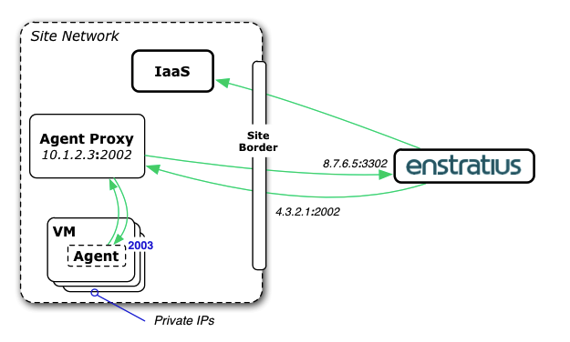

.. _agent_proxy_operations:

Operations
----------

Prerequisites
~~~~~~~~~~~~~

The agent proxy is packaged as a single Java archive file with all dependencies
included. There is no need to set up a container (such as Tomcat), it includes
an embedded Jetty server and a launch script. The only prerequisite is **Java
1.5+**. It can run as a daemon process started from the Linux rc.d system. It
is only packaged for **Linux**.

Configurations
~~~~~~~~~~~~~~

The agent proxy requires configuration as part of the installation process.

In particular the **upstream enStratus URL**, a **unique ID** string, and
an **SSL certificate** need to be set correctly on a per-deployment basis.

An assistance script is provided for quick creation of self-signed certificates.

There are other configurations (timeouts, etc.) that have default values you
can override.

Exact configuration details are outlined in the distributed README as well as
the :ref:`Installation <agent_proxy_installation>` section of this
documentation.

Registration
~~~~~~~~~~~~

Once started, the proxy needs to be registered in the enStratus application. If
the server it is running on is already detected/managed by enStratus, there is a
simple UI action to register it as a proxy (it assumes port 2002). Otherwise,
you will need to enter the appropriate host:port into a dialogue to register.
There is also REST API support for registration (and deregistration).

See the :ref:`Registration <agent_proxy_registration>` section for more detail.

Registration requires the proxy to be running, there is an initial handshake
that occurs. The proxy may be restarted at will after this: if it misses a
message, there will potentially be some automation slowdown but the message will
be repeated in time (this is very similar to an agent being out of contact due
to a cloud network issue - the agent and enStratus are resilient to this).

Load Balancing
~~~~~~~~~~~~~~

Many agent proxies may be put behind a load balancer such as HAProxy. Since
they are stateless (no shared or individual session state), nodes can come and
go at will. But each node must be configured with the same settings: the same
unique ID in particular must be configured across all agent proxy nodes behind
a load balancer.

Networks/Forwarding
~~~~~~~~~~~~~~~~~~~

By default, the Agent Proxy accepts traffic on port 2002. The following diagram
outlines a typical firewall/port-forwarding scheme to enable the agent proxy
running at a site with an offsite enStratus (for on-premises installations this
is analogous to enStratus being installed on a separate site network from IaaS,
as is common):

.. figure:: ./images/proxy-overview2.png
   :align: center

The agent configuration file on the VM (in particular, the ``provisioningProxy``
setting) needs to point to an IP that resolves to the agent proxy. This can be
an internal IP address as long as it resolves to the agent proxy.

Let's update the diagram with sample addresses to be absolutely clear.
Depicted is the agent proxy is running at private IP ``10.1.2.3``, port ``2002``
on the site's network. And the public IP ``4.3.2.1``, port ``2002`` is
forwarding traffic to ``10.1.2.3``, port ``2002``:

In this situation, the VM instances only need to contact ``10.1.2.3``, port
``2002``, not the enStratus application running on the public internet (in the
case of an on-premises deployment, this is analagous to whatever custom site
network enStratus runs on).

The agent proxy needs to be able to contact the VM instances at will (either
by virtue of being on the same subnet or by the proper routing configurations).

enStratus needs to be able to reach ``4.3.2.1``, port ``2002`` in this example.

And the agent proxy needs to be able to reach enStratus at ``8.7.6.5``,
port ``3302``.

Limiting Access
~~~~~~~~~~~~~~~

Networking rules that govern access to the agent proxy should  **only allow
traffic from valid source IP ranges**.

For example, using the setup and addresses in the last section, the firewall
rule that forwards ``4.3.2.1:2002`` to ``10.1.2.3:2002`` should be enhanced to
only forward traffic from enStratus source IPs.

The acceptable ranges include any source IPs that dispatcher, monitor, or
worker traffic appears from. This is especially important in the case where this
open ip:port that maps to the agent proxy is accessible from the internet.

