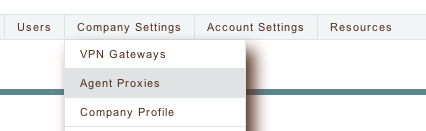
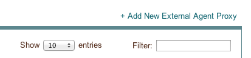
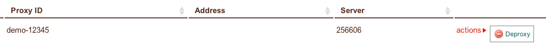

.. _agent_proxy_registration:

Registration
------------

After an agent proxy is running, enStratus will not recognize agent traffic
from it until it has been registered.

This guide shows you how to register (and deregister) agent proxies using the
UI. It assumes you have been through all of the other pages in the agent proxy
documentation, in particular you have installed an agent proxy following the
:ref:`Installation <agent_proxy_installation>` section.

There are two different ways to register agent proxies:

1. Selecting a server because the agent proxy is running on a node that has been detected or launched by enStratus.
2. Entering an arbitrary IP:port to handshake with.

After you do one of those things (see the corresponding section below), the
same final step must occur (covered in the `ID validation`_ section below).

Registering via enStratus server
~~~~~~~~~~~~~~~~~~~~~~~~~~~~~~~~

Use this method if the agent proxy is running on a node that has been detected
or launched by enStratus.

Navigate to the ``Agent Proxies`` screen:

Choose ``Add New External Agent Proxy``:

A dialog will pop up. In this dialog, choose ``Console managed server``.

A set of dropdown menus will now appear: select the appropriate region and
server.

When you are ready to proceed, click the ``Begin Registration`` button.

Now move on to the `ID validation`_ section in the documentation below.

Registering via IP:port
~~~~~~~~~~~~~~~~~~~~~~~

Use this method if the agent proxy is running on a node that has not been
detected or launched by enStratus. Or if the IP:port coordinates are manually
set up (for example, you have manually created a port forwarding rule to a
private cloud resource).

Navigate to the ``Agent Proxies`` screen:

Choose ``Add New External Agent Proxy``:

A dialog will pop up. In this dialog, choose ``External server``.

One field will now appear: manually enter the IP:port to use. This should
look like ``4.3.2.1:1234``.

When you are ready to proceed, click the ``Begin Registration`` button.

Now move on to the `ID validation`_ section in the documentation below.

ID validation
~~~~~~~~~~~~~

After you finish one of the above steps that selects the target for handshaking,
enStratus will contact the agent proxy service. It will call on a special
operation for handshaking and then the enStratus UI will display the ID that
the agent proxy was configured with (or give you an error such as "connection
refused").

If this ID is accurate, click ``Confirm`` and the agent proxy will be registered.
You will now see a status message ``Agent proxy has been associated``. Traffic
relayed from this proxy will now be accepted by enStratus.

You may need to click the ``Reload`` button on the ``Agent Proxies`` screen before
the new proxy is listed in the table.

Proceed from here with an end to end test (see the end of the
:ref:`Installation <agent_proxy_installation>` section).

Deregistering
~~~~~~~~~~~~~

Navigate to the ``Agent Proxies`` screen:

Find the agent proxy in the list that you wish to deactivate. Proxies are listed
here with their enStratus numeric ID (the ``ID`` column) and the unique ID that
you configured the agentproxy with (the ``Proxy ID`` column). If you registered
the proxy using an arbitrary IP:port, that will be listed in the ``Address``
column. If you registered the proxy using a enStratus-managed server, that
server ID will be listed in the ``Server`` column.

Once you have decided which agent proxy to deregister, click on ``actions``
in the appropriate row and choose ``Deproxy``:

The system will ask you if you are sure. If you are sure, choose ``Deregister
as Proxy``.

