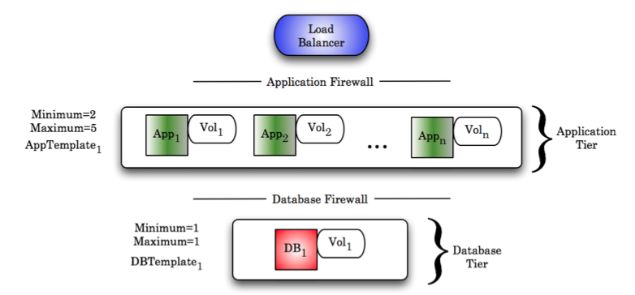
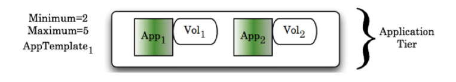
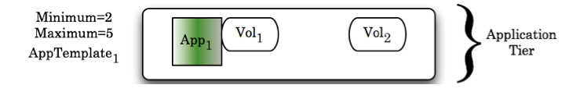
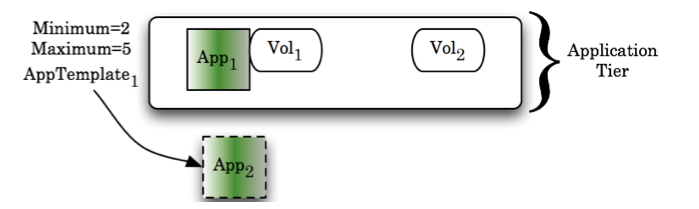
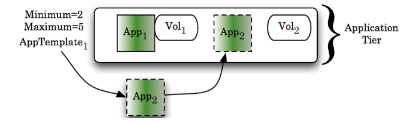
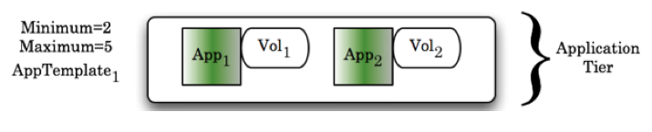

.. _auto_recovery:

Auto-Recovery
-------------

Here we'll walk through at a high level how automation works with Enstratius. We'll use a
block diagram to describe this at a high level. To start, picture a three-tier deployment
like the one shown here:

So far so good. At the application tier, there is a logical connection between each
application server and the volume that is attached. The website code lives on the attached
volume and the server is configured to serve content from the directory where that volume
is mounted.

Next, let's simulate a failure of an application server and see how Enstratius recovers
from that problem. For this section, let's just zoom in to the application tier to follow
the steps taken.

Here is the application tier prior to the failure:

Next, a failure of application server 2 occurs.

Because the number of servers is now less than the minimum required for this tier,
Enstratius starts another server from AppTemplate\ :sub:`1`. 

The new application server is starting. Notice here the "orphaned" volume left by the
failed application server. That volume will become important soon. In the next step, the
new application server joins the tier.

Now, the tier has regained full strength. Next, the orphaned volume is reattached to the
newly created server.

The recovery is complete after the volume is attached.

There is more going on behind the scenes that will answer some of the questions that are
sure to arise from this scenario, but at a block-diagram level, this is how auto-recovery
works. 

For more information please see:

:ref:`Deployment Launch Process <deployment_launch_process>`
