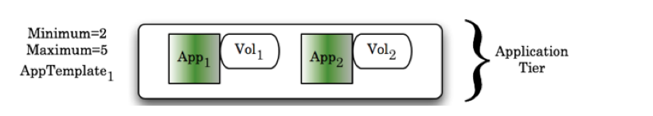
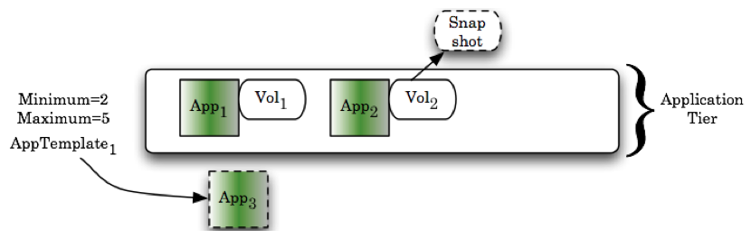
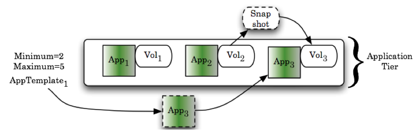

.. _auto_scaling:

Auto Scaling
------------

enStratus take a unique and powerful approach to auto-scaling.  Auto-scaling means
matching provisioned infrastructure to demand. Matching the supply and demand curves of
cloud infrastructure saves you money and keeps customers happy.

Let's take a closer look at how enStratus handles a scaling event. In this example,
the application tier will scale from two to three servers. Starting with our steady state
of operation with two application servers shown below, here is the process enStratus uses
to scale infrastructure.

Consider a scalable pool of application servers running in a tier:

An important first consideration to make is to ensure there is "room" to scale.
That is, the maximum number of servers indicated for the tier is greater than the minimum
number of operating servers. In this example, the application tier has three available
servers positions available, accommodating up to 5 operating application servers.

When a scaling even occurs to include the addition of a new server into the resource pool,
the following process is used. First, enStratus starts a server from the appropriate
template just like in an auto-recovery. The additional step of taking a snapshot of the
attached volumes happens during an auto-scaling where additional servers are provisioned.

Once the newly provisioned server is initialized, it is joined into the resource pool of
running servers. The snapshot that was created in step 1 is used to generate a cloned
volume that is attached to the new application server.

How to Scale
~~~~~~~~~~~~

enStratus accommodates three modes of auto-scaling. First, if the cloud provider has a
predefined mechanism supporting auto-scaling, enStratus will reflect that capability to
the user.

Second, enStratus provides for simple auto-scaling by reading the trailing load averages
of servers running in the tier. If a user-specified threshold is reached, a scaling event
will be triggered.

Third, enStratus supports customizable auto-scaling so application architects can take
control of the scaling behavior on some custom parameter such as the number of connections
per second to the database, number of e-commerce transactions, or some other meaningful
metric that is relevant to the application.

For more information about these modes, please see the section on :ref:`scaling methods <scaling_methods>`
