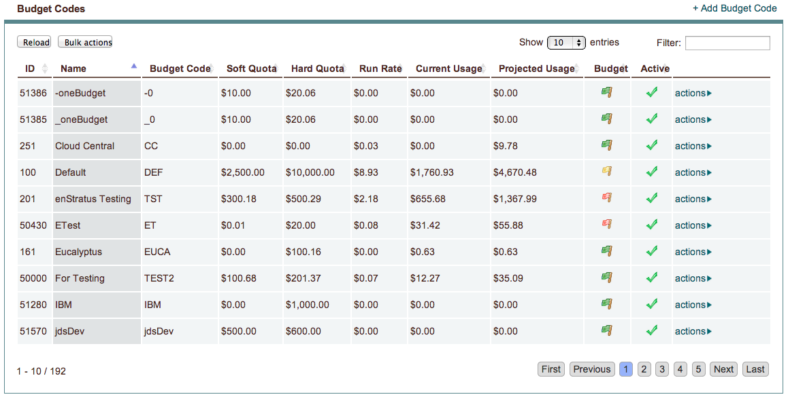
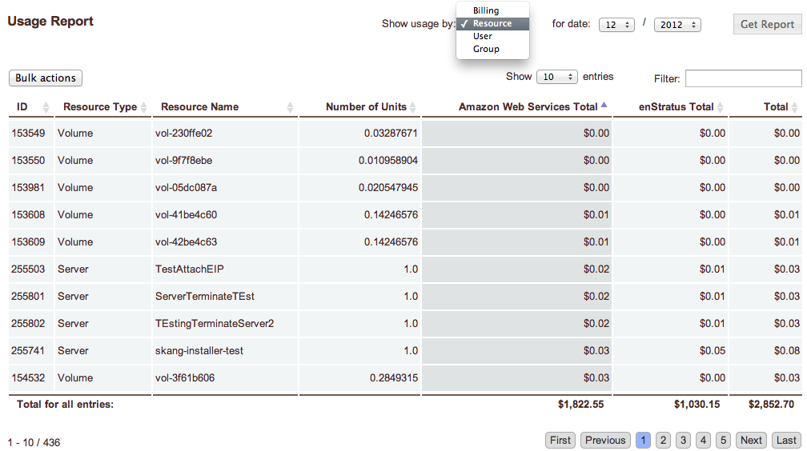

.. _saas_budget:

Budget
======

enStratus financial controls allow for a useful feature for setting quotas and
limiting/tracking costs incurred in the cloud.

   Budget Codes

   Usage Report

.. toctree::
   :maxdepth: 1
   :hidden:

   budget_codes
   invoices
   reports
   summary
