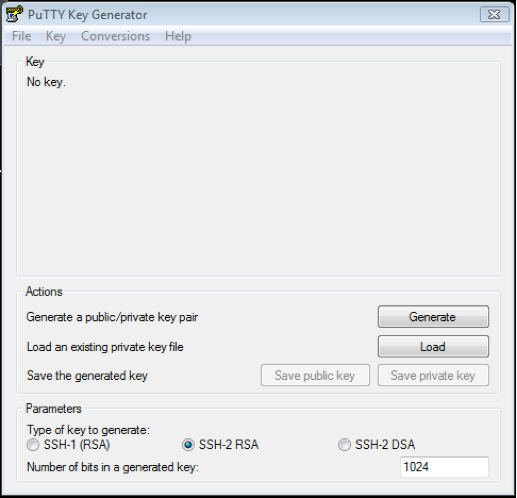
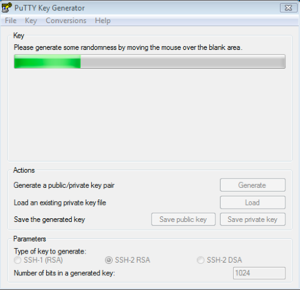
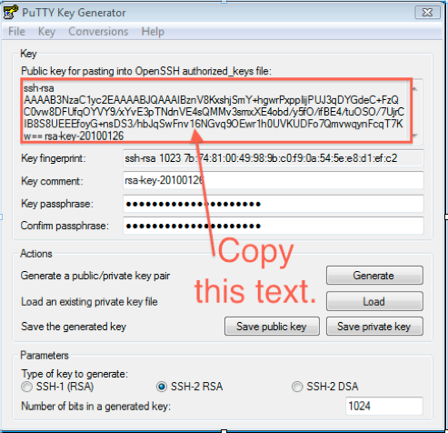
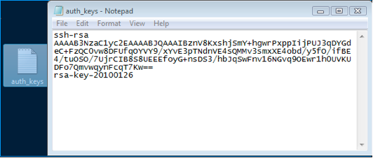
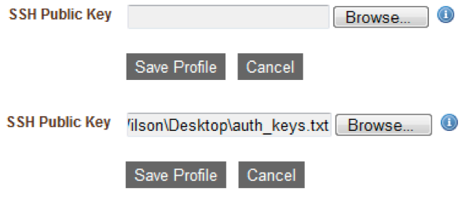
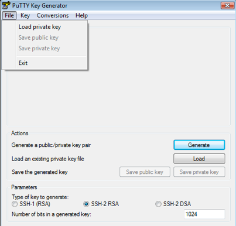
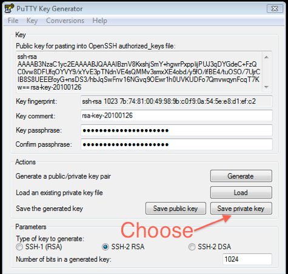

.. _putty_help:

PuTTY
-----

Windows users often turn to PuTTY for an SSH client. Here is a summary for how to use
PuTTY to generate and use SSH keys to access cloud servers.

For more information about SSH keypairs, please see the `OpenSSH Documentation <http://www.openssh.org/manual.html>`_

.. warning:: This document is provided as a guide only, with no guarantee of working.
   Depending on your windows environment, these instructions may or may not apply.

Summary
~~~~~~~

#. Upload your open-ssh formatted public key into enStratus. 
#. Use your Putty formatted private key in putty.

Using PuTTY to generate keys
~~~~~~~~~~~~~~~~~~~~~~~~~~~~

First, download:

#. `putty <http://www.chiark.greenend.org.uk/~sgtatham/putty/download.html>`_
#. `puttygen <http://www.chiark.greenend.org.uk/~sgtatham/putty/download.html>`_

This section assumes you have not already generated any keys. 

Start the putty key generator and choose SSH-2 RSA for the key type.

Click the generate button to generate your keypair. 

This will take a short amount of time. Once complete, you will see the following screen:

Copy the text shown in the window labeled Public key for pasting into OpenSSH
authorized_keys file. enStratus will add this key into your authorized_keys file when you
upload it, which is what we’ll do next.

First, create a text file and paste the key text into it:

I called my file auth_keys, but you may name it anything you wish. It is important to use
a simple text editor to create this file so that no weird meta-characters are in the file.
Also, ensure there are no strange line breaks or other strange characters in the file.

Save the file.

Next, go to the enStratus console and upload your key.

Click Save profile. Your key has been uploaded. Next give yourself shell access to the
instance through enStratus.

If you had already upload another key, you will first have to remove your ssh access to
the instance and then re-enable your access. This is due to the way enStratus handles
adding users.

Convert existing keypair
~~~~~~~~~~~~~~~~~~~~~~~~

If you have already generated an open-ssh keypair on a Linux or \*nix machine, Putty will
have to convert it for use as a key in putty.

When you generated the open-ssh keypair, you should have two files. 

.. code-block:: bash

   id_rsa
   id_rsa.pub

Where ``id_rsa`` is the private half and ``id_rsa.pub`` is the public half. To use the id_rsa key
in putty, it must be converted into a format that putty recognizes.

To do this, first open puttygen:

Next, load your private key into puttygen and enter the passphrase for the key, if
necessary.

Next, choose Save private key. The converted key is saved as ``id_rsa.ppk`` and can be used to
access running instances.
