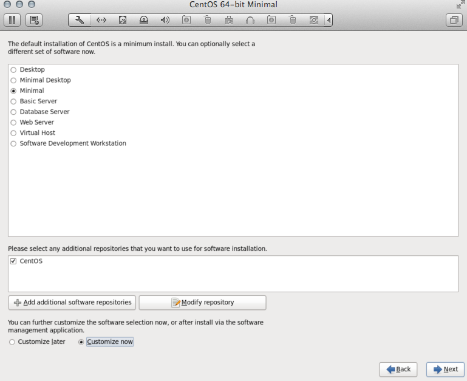
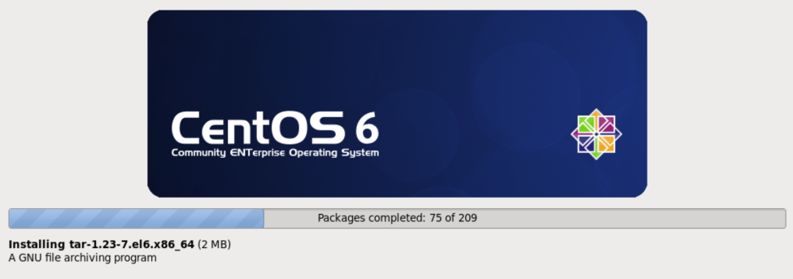

CentOS 6
--------

These guidelines should be highly analagous to the installation of enStratus on a RHEL
environment.

.. warning:: This information is provided as a guideline only. Some subtle differences may
   exist depending on the images provided by the distribution, package mirrors, dependency
   satisfaction, and other factors. 

   The installer provided by enStratus is meant to normalize
   to the maximum extent possible these differences and result in a successful installation
   of the product.

Installation Media
~~~~~~~~~~~~~~~~~~

Use the installation DVD available at the CentOS site.

Choose a minimal installation.

   Minimal CentOS 6 Installation

|

   Minimal CentOS 6 Packages

Networked Services (Pre-Install)
~~~~~~~~~~~~~~~~~~~~~~~~~~~~~~~~

Pre-installation, there should be almost no networked services running. Here is an example:

.. code-block:: bash

   [root@localhost ~]# netstat -tnl

   Active Internet connections (only servers)

   Proto Recv-Q Send-Q Local Address    Foreign Address  State      
   tcp        0      0 0.0.0.0:22       0.0.0.0:*        LISTEN      
   tcp        0      0 :::22            :::*             LISTEN

.. note:: We have installed the openssh server and client packages. These packages may not
   be included in the minimal installation and are technically **not** required. That
   said, you will almost certainly want to install openssh.

Packages (Pre-Setup)
~~~~~~~~~~~~~~~~~~~~

A successful minimal installation environment will install approximately 209 packages. A
sample list of installed packages is available for viewing here:

:download:`Minimal Package List (Pre-Setup) <./files/preSetup.txt>` ( 209 lines )

Packages (Post-Setup)
~~~~~~~~~~~~~~~~~~~~~

Upon completion of the :ref:`Setup Step <running_setup>` step, the list of installed
packages is available for viewing here:

:download:`Minimal Package List (Post-Setup) <./files/postSetup.txt>` ( 240 lines )

For your convenience, a diff of these two files is provided here:

:download:`Setup Differences <./files/setupDiff.txt>`
 
Install Process
~~~~~~~~~~~~~~~

During the installation process, there will be messages written to standard out that
follow the process of the installation. Here is a sample output:

:download:`Install Process <./files/installProcess.txt>` ( 1017 lines )

Upon completion of the install process, the list of installed packages is shown here:

:download:`Post Install <./files/postInstall.txt>` ( 379 lines )

For your convenience a diff of the post-setup and post-install is provided here:

:download:`Install Differences <./files/installDiff.txt>`

Networked Services (Post-Install)
~~~~~~~~~~~~~~~~~~~~~~~~~~~~~~~~~

.. code-block:: bash

   [root@localhost ~]# netstat -tnlp
   Active Internet connections (only servers)
   Proto Recv-Q Send-Q Local Address         Foreign Address  State    PID/Program name   
   tcp        0      0 0.0.0.0:41893         0.0.0.0:*        LISTEN   4068/beam           
   tcp        0      0 0.0.0.0:3302          0.0.0.0:*        LISTEN   5239/java           
   tcp        0      0 0.0.0.0:9191          0.0.0.0:*        LISTEN   6761/java           
   tcp        0      0 0.0.0.0:3306          0.0.0.0:*        LISTEN   5005/mysqld         
   tcp        0      0 0.0.0.0:4369          0.0.0.0:*        LISTEN   3147/epmd           
   tcp        0      0 0.0.0.0:22            0.0.0.0:*        LISTEN   1881/sshd           
   tcp        0      0 127.0.0.1:8087        0.0.0.0:*        LISTEN   4371/beam.smp       
   tcp        0      0 0.0.0.0:15000         0.0.0.0:*        LISTEN   10043/java          
   tcp        0      0 0.0.0.0:55672         0.0.0.0:*        LISTEN   4068/beam           
   tcp        0      0 0.0.0.0:41593         0.0.0.0:*        LISTEN   4371/beam.smp       
   tcp        0      0 0.0.0.0:8443          0.0.0.0:*        LISTEN   5367/java           
   tcp        0      0 0.0.0.0:2013          0.0.0.0:*        LISTEN   5155/java           
   tcp        0      0 172.16.243.163:8098   0.0.0.0:*        LISTEN   4371/beam.smp       
   tcp        0      0 127.0.0.1:8098        0.0.0.0:*        LISTEN   4371/beam.smp       
   tcp        0      0 0.0.0.0:8099          0.0.0.0:*        LISTEN   4371/beam.smp       
   tcp        0      0 :::5672               :::*             LISTEN   4068/beam           
   tcp        0      0 ::ffff:127.0.0.1:1103 :::*             LISTEN   8918/java           
   tcp        0      0 :::22                 :::*             LISTEN   1881/sshd

For more information about the networked services, please visit the :ref:`enStratus
Communications <enstratus_communications>` page.
