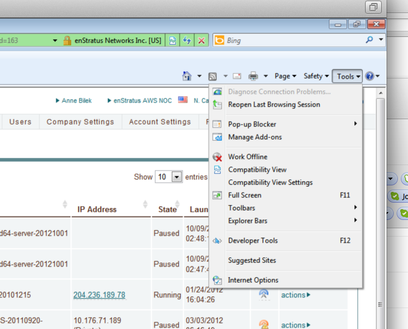
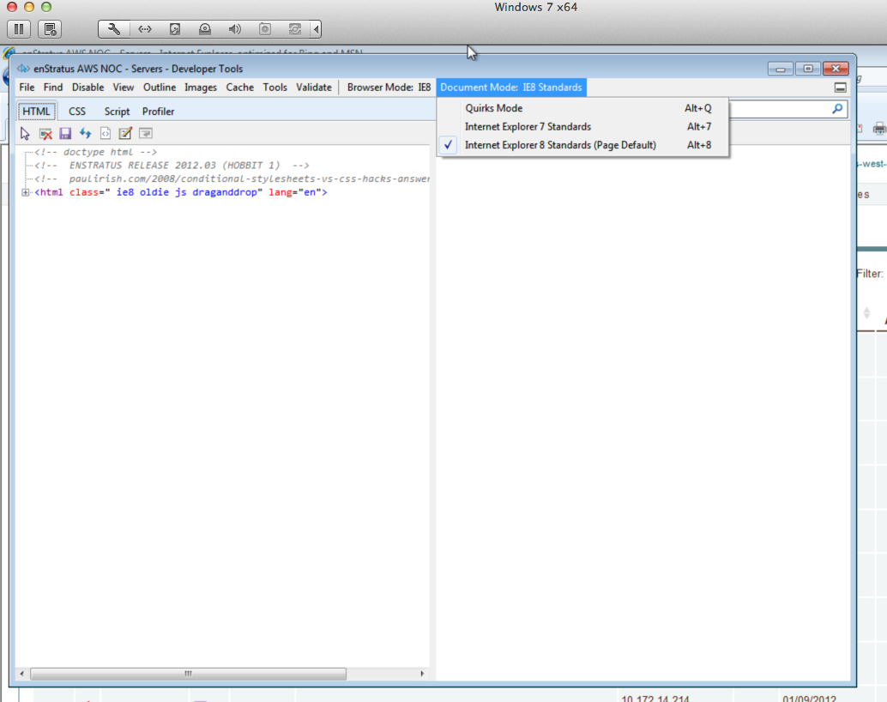

.. _msie:

Microsoft Internet Explorer
---------------------------

Here is some guidance for users accessing enStratus with Microsoft Internet Explorer.

If your browser is >= MSIE 8, but operating in MSIE 7 document mode, this will result in a
degraded browser experience when operating the enStratus cloud management platform.

To check your browser's document mode, open Developer Tools. In IE8, go to the Tools menu
and select Developer Tools (or hit F12)

   MSIE 8 Developer Tools

In IE9, click on the "Settings" icon and select Developer Tools (or hit F12)

.. figure:: ./images/msie2.png
   :align: center

   MSIE 9 Developer Tools

At the top right of the Developer Tools window, you will see the Browser Mode and the
Document Mode. Please ensure the Document Mode is set to the highest possible version of
the browser.

   MSIE 8 Document Mode

.. figure:: ./images/msie4.png
   :align: center

   MSIE 9 Document Mode
