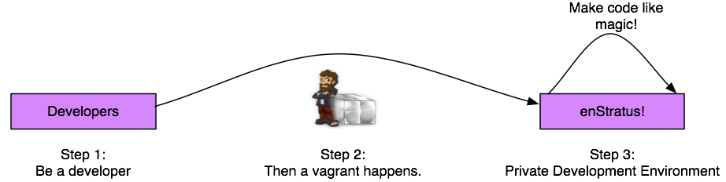
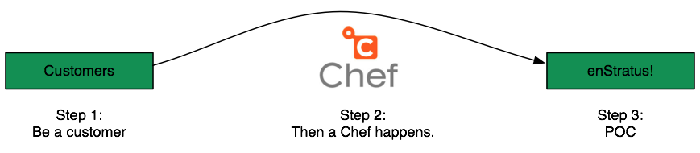

.. enStratus documentation master file, created by
   sphinx-quickstart on Mon Mar 12 21:46:44 2012.
   You can adapt this file completely to your liking, but it should at least
   contain the root `toctree` directive.

On-Premise
==========

On-Premise installations of enStratus make sense for many reasons, and, due to the
flexibility of the enStratus architecture, you can deploy enStratus as a single-node
personal development environment, two-node POC, or a fully scaled high-availability cloud
management solution.

Developers
----------

Setting up a development enStratus environment or a single-node enStratus environment for
sales/demonstration purposes just got a whole lot simpler. By leveraging vagrant, you can
install the full enStratus cloud management software stack in less than 15 minutes,
depending on your network speed.

POC
---

Installing enStratus cloud management software as part of a POC can be done by leveraging
a configuration management engine like Chef from Opscode.

We'll show you how to install enStratus in a 1 or 2-node architecture.

Production
----------

.. figure:: ./images/ha_enstratus.png
   :height: 588 px
   :width: 931 px
   :scale: 85 %
   :alt: High-Availability enStratus Architecture
   :align: center

enStratus can also be deployed in a High-Availability production architecture to support
hundreds of users and cloud accounts. 

.. toctree::
   :maxdepth: 3
   :hidden:
   :glob:

   architecture/architecture
   requirements/requirements
   installation/installation
   administration/administration
   help/help
