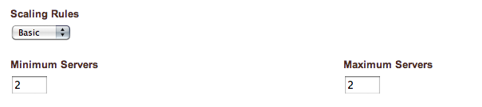
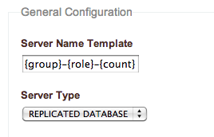
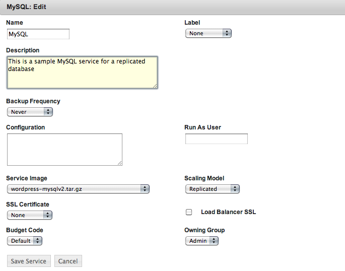
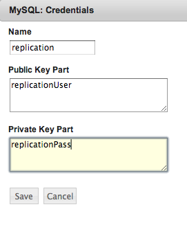

Replicated MySQL database
--------------------------

In this section we'll re-configure our MySQL tier to launch and configure an additional
MySQL slave server that will provide an almost real-time read-only copy of the datasource
in the DB master. Database slaves not only offer redundancy but can be also used to
offload heavy tasks from the master such as backups or long running queries. Our Wordpress
service image includes the HyperDB plugin that enables reads from the slaves, thus
improving overall performance by parallelizing DB requests.

Let's go over the configuration of the MySQL tier:

In the Tier Scaling Rules, set both the Minimum and Maximum number of server to 2 (i.e. 1
master + 1 slave)

   MySQL tier scaling rules 

In the Launch Configuration, set the Server Type to REPLICATED DATABASE

   Launch Configuration : Replicated database

Edit the MySQL service properties and set the Scaling Model to Replicated.
    

   Service : Replicated scaling model

Also in the MySQL service add a new set of credentials, as :ref:`we did for the MySQL root
user <add_db_credentials>`, but this time for the user that will be used to establish the
replication. The name field must be **replication**. The Public and Private key fields
will contain the actual name of the user and its password. Enstratius and the MySQL service
scripts will take care of the rest!

   Service : Replication credentials

Now we're ready to launch the deployment. Two servers will be started,
Database-Tier-master-0 and Database-Tier-replicant-1. We can verify the replication
process by running the *SHOW SLAVE STATUS* command from the MySQL shell from the slave:

.. code-block:: mysql

    mysql> show slave status\G
    *************************** 1. row ***************************
    Slave_IO_State: Waiting for master to send event
    Master_Host: xxx.yyy.www.zzz
    Master_User: replicationUser
    Master_Port: 3306
    Connect_Retry: 60
    Master_Log_File: mysql-bin.000004
    Read_Master_Log_Pos: 574858
    Relay_Log_File: mysql-relay-bin.000004
    Relay_Log_Pos: 253
    Relay_Master_Log_File: mysql-bin.000004
    Slave_IO_Running: Yes
    Slave_SQL_Running: Yes
    
.. note ::

    Our MySQL service image uses a non-standard socket path. To connect to the local MySQL instance remember to include the defaults-file, for example:
    
    .. code-block:: bash

        mysql --defaults-file=/mnt/services/serviceID/cfg/my.cnf -umysqluser -pmysqlpassword

   Substituting serviceId by the service id for the MySQL service and mysqluser and mysqlpassword by the ones entered in the admin credentials set
