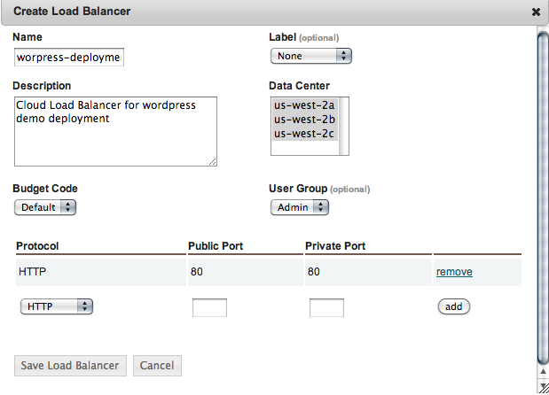
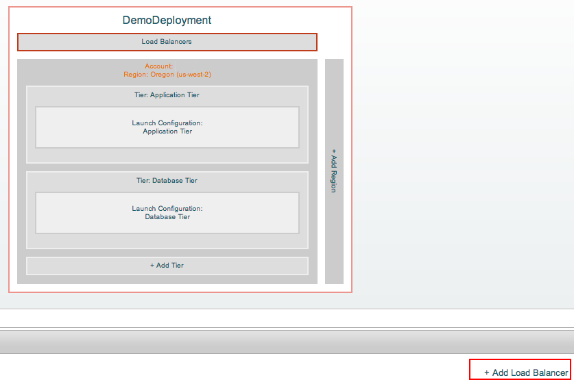
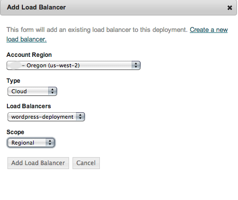
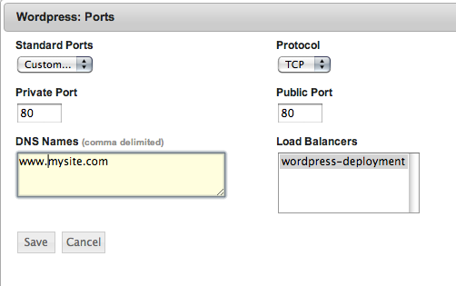
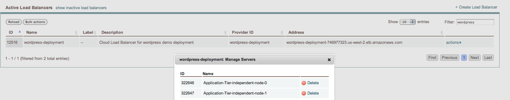

Load Balancer
-------------

Load balancers provide a single point of access to applications, in the form of a single DNS name associated to one or multiple IP addresses. The load balancer will distribute incoming requests to active nodes in the Application tier. enStratus will manage the addition/deletion of nodes to the LB after the start or termination of nodes in that tier.

.. note::
    Before going further you may want to learn more about `Load Balancer suport in enStratus <http://docs.enstratus.com/network/load_balancers.html>`_

enStratus supports 3 types of Load balancer:

* Cloud load balancers, for those cloud providers that offer a Load Balancer resource, such as AWS ELB
* Static load balancers, that is, a running server with the enStratus agent and the specialized LB software installed
* Dynamic load balancers. In this case enStratus will provision a node from a server image when the deployment is started to act as a LB.

For the sake of simplicity we'll explore the first option, by using an Elastic Load Balancer in the AWS cloud.

Create a Elastic Balancer
~~~~~~~~~~~~~~~~~~~~~~~~~~

Let's create a Load Balancer in the us-west-2 region from Network -> Load Balancers . Select all availability zones in that region, and add a listener for the port 80 http.

   Create Load Balancer

After a few minutes the Load Balancer will show in the Active Load Balancers List. Take note of the Address field , it  will be used to access our Wordpress site once the deployment is launched. If you named it wordpress-deployment and created it in the us-west-2 region its address will be something like wordpress-deployment-XXXXXXXX.us-west-1.elb.mamazonaws.com For a real application you will want to create a DNS alias pointing to that name.

.. warning:: 

    Elastic Load Balancers have an ongoing cost so don't forget to delete it when you are done with your testing.
    
Add the Load Balancer to the deployment
~~~~~~~~~~~~~~~~~~~~~~~~~~~~~~~~~~~~~~~~

Go back to Designer and select the demo deployment. On the diagram, click the Load Balancers and click the +Add Load Balancer below

   Add Load balancer to a deployment

Select the Account/Region and the Cloud type, then pick your newly created LB from the list. For the Scope you may select Regional or Data center, depending on whether you prefer to launch the nodes of the application tier in a single availability zone or spread then across several zones in the us-west-2 region.

   Add cloud load balancer
   
Let's go back and review the configuration of the port 80 for the **Wordpress tier** . Remember when we `added the port <http://tutorials.enstratus.com/wordpressdemo/configure_ports.html>`_?. This time our LB will appear in the LB text area, so click on it to select it.

   Selecting the LB in the Ports form

You can launch the deployment now or move over the  :doc:`Database replication setup <DBreplication>` first. Once the server(s) in the application tier has been configured enStratus (i.e. the Wordpress service image has been downloaded and the proper configuration files generated) enStratus  will add the node(s) to the Elastic Load Balancer. We can verify it by clicking on the Manage Servers action 

   Listing the servers attached to an ELB

Opening the URL of the Load Balancer will display the Wordpress homepage we are already familiar with.

.. note ::

    Our Wordpress service image uses the public IP of the front-end application server as the base URL so it's easier to test the configuration without using a real DNS domain. As a side effect internal links will expose this IP, instead of the Load Balancer IP address. Using a DNS domain as the base Wordpress URL would make the load balancer integration seamless.
